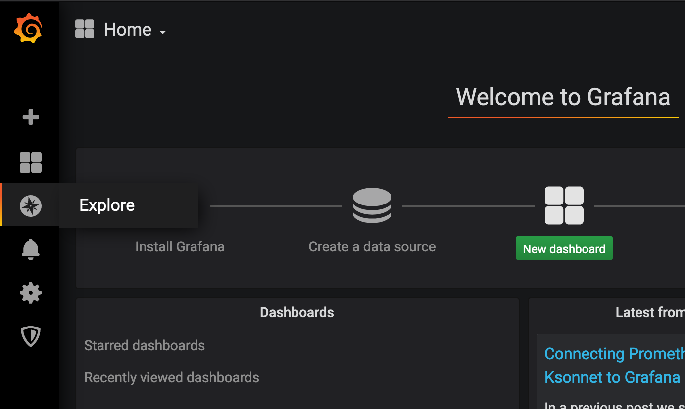
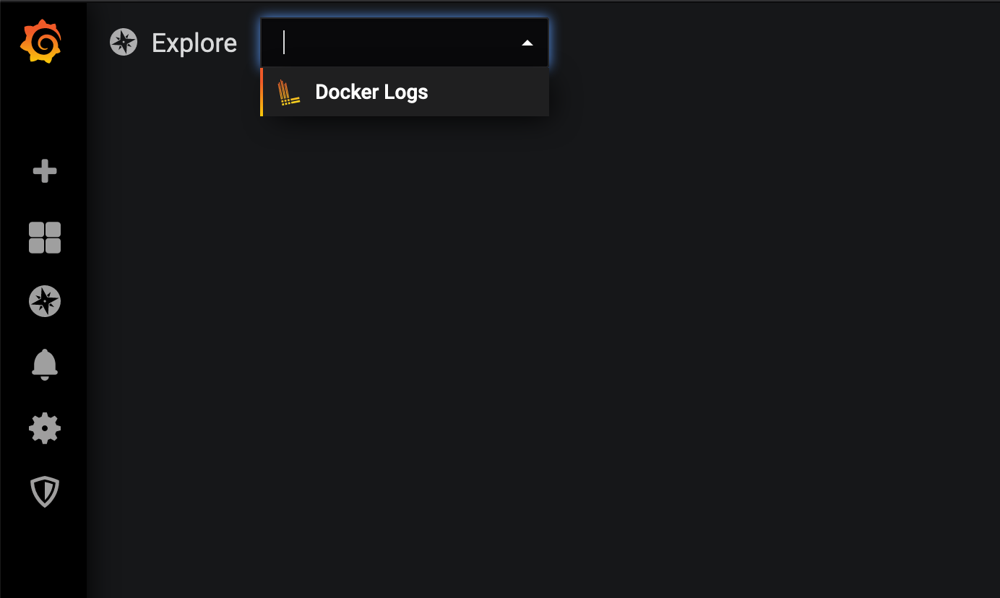
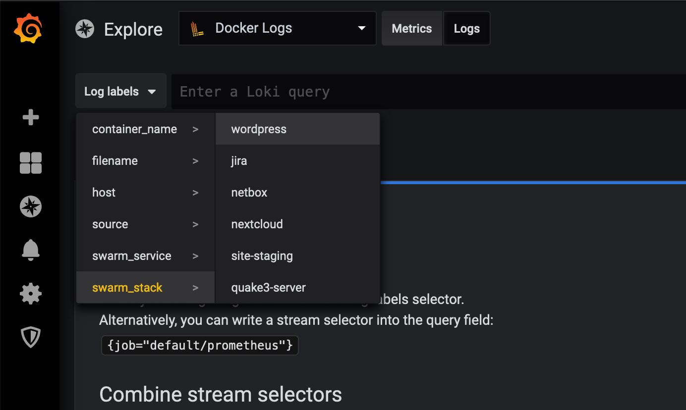

# Grafana Setup for Planetary Quantum

https://www.planetary-quantum.com/

In order to access logs and metrics in a unified fashion, this repository contains an example for installing Grafana on your Quantum cluster.

## Deploy

In order to deploy, you'll need our [`quantum-cli` tool](https://cli.planetary-quantum.com/).

Then follow these two steps:

### Create stack file

Copy the `cp docker-compose.example.yml docker-compose.yml`, and edit it:

 * set the `traefik.frontend.rule` label to include the hostname of your endpoint/cluster (or your custom domain, if you want that)
 * set `INITIAL_ADMIN_PASSWORD` to something random
 * set `QUANTUM_ENDPOINT` to the name of your endpoint/cluster

### Deploy it

```
$ QUANTUM_ENDPOINT=your-cluster-name
$ quantum-cli stack update --create --wait --stack "grafana-$QUANTUM_ENDPOINT"
```

## Basic usage

* on the left-hand side menu choose "Explore"
  
* select "Docker Logs" at the top, and click on "Logs" right next to it
  
* select some log label via the drop-down next to the search bar
  
* you should now see your logs

For metrics: go to Dashboards :point_right: Manage. There should be one pre-configured dashboard "Usage by Stack".
